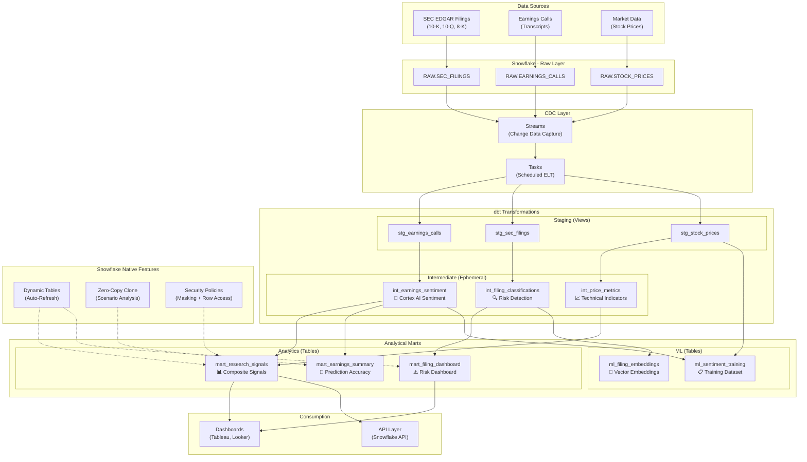

# Cortex Research Intelligence

[](https://docs.getdbt.com/)
[](https://www.snowflake.com/en/data-cloud/cortex/)
[](https://www.snowflake.com/)
[](LICENSE)

## AI-Powered Earnings & Filing Analytics for Investment Research

A production-grade **Snowflake + dbt** consulting portfolio project demonstrating advanced Snowflake features for automated financial intelligence. This project analyzes SEC filings and earnings call transcripts using **Snowflake Cortex AI**, builds version-controlled transformations with **dbt**, and delivers real-time research signals through **Dynamic Tables**, **Streams & Tasks**, and **Zero-Copy Cloning**.

---

## Architecture Overview



---

## Overview

**Cortex Research Intelligence** is an end-to-end data platform built on Snowflake that automates the analysis of corporate financial communications to generate actionable investment research signals.

The system ingests raw earnings call transcripts and SEC filing sections, enriches them with **Snowflake Cortex AI** for sentiment analysis and text summarization, and combines the NLP signals with price-based technical indicators to produce composite research scores. The entire transformation pipeline is version-controlled using **dbt**, with **Dynamic Tables** providing near real-time refresh and **Streams & Tasks** enabling event-driven ELT processing.

Key business value:
- **Automated NLP**: Leverages Snowflake Cortex AI (Sentiment, Summarize, Embed) to analyze thousands of pages of financial text without moving data
- **Real-time signals**: Dynamic Tables with configurable target lag deliver fresh research signals
- **Cost-efficient CDC**: Streams and Tasks eliminate full-refresh ETL, reducing warehouse compute costs by up to 90%
- **Scenario modeling**: Zero-Copy Cloning enables instant environment duplication for stress testing and what-if analysis
- **Enterprise security**: Dynamic Data Masking and Row Access Policies enforce data governance at the database level

---

## Key Features

| Feature | Snowflake Capability | Description |
|---|---|---|
| 🤖 **AI Sentiment Analysis** | Snowflake Cortex AI (`SENTIMENT`) | Analyze earnings call transcripts and filing sections for sentiment polarity |
| 📝 **AI Summarization** | Snowflake Cortex AI (`SUMMARIZE`) | Generate executive summaries from lengthy financial documents |
| 🧮 **Vector Embeddings** | Snowflake Cortex AI (`EMBED_TEXT`) | Create embeddings for semantic similarity search across filings |
| 🔄 **Auto-Refresh Layers** | Dynamic Tables | Materialized views that automatically refresh as source data changes |
| 📡 **Change Data Capture** | Streams | Track DML changes on raw tables for incremental processing |
| ⏰ **Scheduled ELT** | Tasks | Cron-based scheduling for dbt model execution and data pipelines |
| 🧬 **Scenario Analysis** | Zero-Copy Cloning | Instant database duplication without data movement for testing |
| 🔒 **Column Masking** | Dynamic Data Masking | Role-based masking of sensitive fields (transcripts, sentiment scores) |
| 🛡️ **Row-Level Security** | Row Access Policies | Sector-based row access control for multi-tenant analyst teams |
| 🏷️ **Data Governance** | Tag-Based Policies | Automated classification of sensitive data columns |
| 📊 **Version-Controlled SQL** | dbt Core | Modular, tested, and documented SQL transformations |

---

## Architecture Details

### Schema Layout

```
CORTEX_RESEARCH (Database)
├── RAW                    # Source data landing zone
│   ├── earnings_calls     # Earnings call transcripts
│   ├── sec_filings        # SEC filing sections
│   └── stock_prices       # Daily OHLCV price data
├── STAGING                # dbt-managed staging and intermediate models
│   ├── stg_earnings_calls     (View)
│   ├── stg_sec_filings        (View)
│   ├── stg_stock_prices       (View)
│   ├── int_earnings_sentiment (Table)
│   ├── int_filing_classifications (Table)
│   └── int_price_metrics      (Table)
├── ANALYTICS              # Business-facing marts
│   ├── mart_research_signals  (Table)
│   ├── mart_earnings_summary  (Table)
│   ├── mart_filing_dashboard  (Table)
│   └── event_log              (Table)
├── ML                     # Machine learning layer
│   ├── ml_filing_embeddings   (Table)
│   └── ml_sentiment_training  (Table)
└── GOVERNANCE             # Security policies and tags
```

### Warehouse Sizing Strategy

| Warehouse | Size | Use Case | Auto-Suspend |
|---|---|---|---|
| `CORTEX_WH` | X-Small | Cortex AI functions, Dynamic Tables, ML | 60 seconds |
| `DBT_WH` | X-Small | dbt transformations, Task execution | 60 seconds |

> **Cost Tip**: Start with X-Small and scale up only when Dynamic Table refresh times exceed target lag. Most queries in this project complete in seconds on X-Small.

---

## Quick Start

### Prerequisites

- [dbt Core](https://docs.getdbt.com/docs/core/installation) installed (v1.8+)
- [Snowflake account](https://signup.snowflake.com/) with Enterprise Edition (for Cortex AI)
- Python 3.8+ with `dbt-snowflake` adapter

### 1. Clone the Repository

```bash
git clone https://github.com/your-org/snowflake-cortex-research.git
cd snowflake-cortex-research
```

### 2. Install Dependencies

```bash
dbt deps
```

### 3. Configure Snowflake Connection

Set environment variables:

```bash
export SNOWFLAKE_ACCOUNT="your-account-id"
export SNOWFLAKE_USER="your-username"
export SNOWFLAKE_PASSWORD="your-password"
```

Copy `profiles.yml` to `~/.dbt/profiles.yml`:

```bash
mkdir -p ~/.dbt
cp profiles.yml ~/.dbt/profiles.yml
```

### 4. Set Up Snowflake Infrastructure

Run the setup script in Snowflake Worksheet (requires ACCOUNTADMIN):

```sql
-- Execute scripts/setup_snowflake.sql
-- Then execute scripts/create_sample_data.sql
```

### 5. Load Seed Data

```bash
dbt seed --full-refresh
```

### 6. Run dbt Models

```bash
# Run all models
dbt run

# Run specific layer
dbt run --select staging
dbt run --select intermediate
dbt run --select marts

# Run with explain
dbt run --select mart_research_signals --vars '{explain: true}'
```

### 7. Run Tests

```bash
dbt test
```

### 8. Generate Documentation

```bash
dbt docs generate
dbt docs serve
```

---

## dbt Project Structure

```
snowflake-cortex-research/
├── dbt_project.yml              # Project configuration
├── profiles.yml                 # Snowflake connection profile
├── packages.yml                 # dbt package dependencies
├── models/
│   ├── sources.yml              # Source table definitions
│   ├── staging/
│   │   ├── stg_earnings_calls.sql    # Clean earnings transcripts
│   │   ├── stg_sec_filings.sql       # Clean SEC filing sections
│   │   ├── stg_stock_prices.sql      # Clean OHLCV price data
│   │   └── _staging_models.yml      # Tests & descriptions
│   ├── intermediate/
│   │   ├── int_earnings_sentiment.sql    # AI sentiment enrichment
│   │   ├── int_filing_classifications.sql # Risk categorization
│   │   ├── int_price_metrics.sql          # Technical indicators
│   │   └── _intermediate_models.yml
│   └── marts/
│       ├── analytics/
│       │   ├── mart_research_signals.sql  # Composite research signals
│       │   ├── mart_earnings_summary.sql  # Earnings analytics
│       │   ├── mart_filing_dashboard.sql  # Filing risk dashboard
│       │   └── _mart_models.yml
│       └── ml/
│           ├── ml_filing_embeddings.sql    # Vector embeddings
│           ├── ml_sentiment_training.sql   # Training dataset
│           └── _ml_models.yml
├── macros/
│   ├── cortex_sentiment.sql       # SNOWFLAKE.CORTEX.SENTIMENT wrapper
│   ├── cortex_summarize.sql       # SNOWFLAKE.CORTEX.SUMMARIZE wrapper
│   ├── cortex_embeddings.sql      # SNOWFLAKE.CORTEX.EMBED_TEXT wrapper
│   └── generate_schema_name.sql   # Custom schema naming
├── seeds/
│   ├── sample_earnings_calls.csv  # 33 rows of earnings data
│   ├── sample_sec_filings.csv     # 32 rows of filing data
│   └── sample_stock_prices.csv    # 210 rows of price data
├── scripts/
│   ├── setup_snowflake.sql        # Infrastructure setup
│   ├── create_dynamic_tables.sql  # Dynamic Tables DDL
│   ├── setup_streams_tasks.sql    # CDC Streams & Scheduled Tasks
│   ├── create_sample_data.sql     # Raw table DDL
│   └── security_policies.sql      # Masking & Row Access Policies
├── tests/
│   └── test_earnings_consistency.sql
└── assets/
    └── (screenshots and diagrams)
```

---

## Key Models

| Model | Layer | Materialization | Description | Refresh |
|---|---|---|---|---|
| `stg_earnings_calls` | Staging | View | Cleans raw transcripts, filters by date and text quality | On query |
| `stg_sec_filings` | Staging | View | Cleans filing data, extracts fiscal period | On query |
| `stg_stock_prices` | Staging | View | Cleans OHLCV, computes daily returns | On query |
| `int_earnings_sentiment` | Intermediate | Table | Cortex AI sentiment + summary (keyword fallback for trial) | dbt run |
| `int_filing_classifications` | Intermediate | Table | Risk category + sentiment polarity classification | dbt run |
| `int_price_metrics` | Intermediate | Table | 20/50-day MA, volatility, Sharpe-like ratio | dbt run |
| `mart_research_signals` | Analytics | Table | Composite signal combining sentiment + risk + price | dbt run / DT |
| `mart_earnings_summary` | Analytics | Table | Post-earnings price reaction + prediction accuracy | dbt run |
| `mart_filing_dashboard` | Analytics | Table | Risk dashboard with trend tracking | dbt run / DT |
| `ml_filing_embeddings` | ML | Table | Cortex embeddings for semantic similarity | Weekly |
| `ml_sentiment_training` | ML | Table | Training features + labels for custom ML models | Weekly |

---

## Sample Queries

Explore the research signals with these ready-to-use SQL queries:

### Top 10 Bullish Signals

```sql
SELECT
    ticker,
    close_price,
    ceo_sentiment,
    volatility_pct,
    sharpe_ratio,
    composite_signal_score,
    signal_direction,
    signal_generated_at
FROM CORTEX_RESEARCH.ANALYTICS.MART_RESEARCH_SIGNALS
WHERE signal_direction = 'BULLISH'
ORDER BY composite_signal_score DESC
LIMIT 10;
```

### Companies with Increasing Risk Flags

```sql
SELECT
    ticker,
    filing_type,
    fiscal_year,
    fiscal_quarter,
    total_filings,
    risk_flagged_filings,
    risk_pct,
    risk_level
FROM CORTEX_RESEARCH.ANALYTICS.MART_FILING_DASHBOARD
WHERE risk_level IN ('HIGH_RISK', 'MEDIUM_RISK')
ORDER BY risk_pct DESC;
```

### Post-Earnings Price Reaction Analysis

```sql
SELECT
    ticker,
    company_name,
    call_date,
    sentiment_label,
    sentiment_score,
    post_earnings_5d_return_pct,
    max_daily_move_pct,
    prediction_accuracy
FROM CORTEX_RESEARCH.ANALYTICS.MART_EARNINGS_SUMMARY
WHERE prediction_accuracy IN ('Accurate Positive', 'Accurate Negative')
ORDER BY ABS(post_earnings_5d_return_pct) DESC
LIMIT 15;
```

### CEO Sentiment Trend by Company

```sql
SELECT
    ticker,
    company_name,
    quarter,
    fiscal_year,
    sentiment_score,
    sentiment_label
FROM CORTEX_RESEARCH.ANALYTICS.MART_EARNINGS_SUMMARY
WHERE speaker_role = 'CEO'
ORDER BY ticker, fiscal_year, quarter;
```

### Filing Risk Category Breakdown

```sql
SELECT
    risk_category,
    COUNT(*) AS filing_count,
    COUNT(DISTINCT ticker) AS company_count,
    AVG(text_length) AS avg_section_length
FROM CORTEX_RESEARCH.STAGING.INT_FILING_CLASSIFICATIONS
WHERE risk_category != 'OPERATIONAL'
GROUP BY risk_category
ORDER BY filing_count DESC;
```

### Similarity Search Using Embeddings

```sql
-- Find filings similar to a target filing (Cosine similarity)
SELECT
    a.filing_id,
    a.ticker,
    a.filing_type,
    a.risk_category,
    VECTOR_DOT_PRODUCT(a.embedding_vector, (
        SELECT embedding_vector
        FROM CORTEX_RESEARCH.ML.ML_FILING_EMBEDDINGS
        WHERE filing_id = 'SF-001'
    )) / (
        VECTOR_NORM(a.embedding_vector) *
        VECTOR_NORM((SELECT embedding_vector FROM CORTEX_RESEARCH.ML.ML_FILING_EMBEDDINGS WHERE filing_id = 'SF-001'))
    ) AS cosine_similarity
FROM CORTEX_RESEARCH.ML.ML_FILING_EMBEDDINGS a
WHERE a.filing_id != 'SF-001'
ORDER BY cosine_similarity DESC
LIMIT 10;
```

---

## Security

This project implements Snowflake-native security features for enterprise data governance:

### Dynamic Data Masking

| Policy | Column | Effect |
|---|---|---|
| `transcript_mask` | `transcript_text` | Full text for `ANALYST_ROLE`; truncated for `SECTOR_*`; redacted for others |
| `sentiment_range_mask` | `sentiment_score` | Exact values for analysts; binned values (±0.25, ±0.75) for others |
| `embedding_mask` | `embedding_vector` | Full vectors for `DATA_SCIENCE_ROLE`; zero-vectors for others |

### Row Access Policies

| Role | Visible Tickers |
|---|---|
| `ADMIN_ROLE` | All tickers |
| `ANALYST_ROLE` | All tickers |
| `DATA_SCIENCE_ROLE` | All tickers |
| `SECTOR_TECH_ROLE` | AAPL, MSFT, GOOGL, NVDA, META |
| `SECTOR_ENERGY_ROLE` | TSLA |

Setup scripts are in `scripts/security_policies.sql`.

---

## Cost Optimization

### Snowflake Credit Management Tips

1. **Auto-Suspend Warehouses**: Both `CORTEX_WH` and `DBT_WH` auto-suspend after 60 seconds of inactivity. This is the single most impactful cost control.

2. **Right-Size Warehouses**: Start with X-Small. Monitor Dynamic Table refresh times with:
   ```sql
   SELECT TABLE_NAME, TARGET_LAG, REFRESH_MODE, DATA_TIMESTAMP
   FROM TABLE(INFORMATION_SCHEMA.DYNAMIC_TABLE_REFRESH_HISTORY(
       DATEADD(hour, -24, CURRENT_TIMESTAMP())
   ));
   ```
   Scale up only if refresh times consistently exceed target lag.

3. **Zero-Copy Cloning Instead of Data Duplication**: Cloning creates a copy of the database metadata without duplicating storage. Only changed data consumes additional storage.
   ```sql
   -- Instant clone for scenario analysis
   CREATE DATABASE CORTEX_RESEARCH_SCENARIO CLONE CORTEX_RESEARCH;
   ```

4. **Streams for Incremental Processing**: Instead of full-refresh ETL, use CDC streams to process only changed records. This can reduce warehouse compute by up to 90%.

5. **Dynamic Tables vs dbt Models**: Use Dynamic Tables for near-real-time needs. Use dbt models (incremental materialization) for batch transformations to avoid continuous warehouse costs.

6. **Task Scheduling**: Schedule resource-intensive tasks during off-peak hours. The `CORTEX_WH` tasks run at 2 AM Sunday for ML workloads.

---

## Zero-Copy Cloning for Scenario Analysis

```sql
-- Clone the entire database for a stress test scenario
CREATE DATABASE CORTEX_RESEARCH_STRESS_TEST CLONE CORTEX_RESEARCH;

-- In the cloned database, simulate adverse market conditions
USE DATABASE CORTEX_RESEARCH_STRESS_TEST;

-- Simulate 40% sentiment degradation
UPDATE STAGING.INT_EARNINGS_SENTIMENT
SET sentiment_score = sentiment_score * 0.6 - 0.2;

-- Rebuild marts in the scenario
-- dbt run --project-dir ./scenario-stress-test --profiles-dir ~/.dbt

-- Compare scenario results
SELECT a.ticker, a.composite_signal_score AS baseline,
       b.composite_signal_score AS stress_test,
       a.composite_signal_score - b.composite_signal_score AS delta
FROM CORTEX_RESEARCH.ANALYTICS.MART_RESEARCH_SIGNALS a
JOIN CORTEX_RESEARCH_STRESS_TEST.ANALYTICS.MART_RESEARCH_SIGNALS b
  ON a.ticker = b.ticker;

-- Drop clone when done (no data movement cost)
DROP DATABASE CORTEX_RESEARCH_STRESS_TEST;
```

---

## Screenshots

> Screenshots are stored in the `assets/` directory.

- **Workspace Screenshot**: `assets/workspace_screenshot.png` — Snowflake Worksheets with project objects
- **Architecture Diagram**: `assets/architecture_diagram.png` — High-level data flow visualization
- **dbt Docs**: Run `dbt docs serve` to generate interactive model documentation

---

## Technologies

| Technology | Purpose |
|---|---|
| [Snowflake](https://www.snowflake.com/) | Cloud data platform (compute, storage, security) |
| [Snowflake Cortex AI](https://www.snowflake.com/en/data-cloud/cortex/) | Serverless LLM functions (Sentiment, Summarize, Embed) |
| [dbt Core](https://www.getdbt.com/) | SQL transformation framework |
| [dbt-snowflake](https://docs.getdbt.com/docs/core/connect-data-platform/snowflake-setup) | Snowflake adapter for dbt |
| [dbt-utils](https://hub.getdbt.com/dbt-labs/dbt_utils/) | Utility macros and tests |
| [Snowflake Dynamic Tables](https://docs.snowflake.com/en/user-guide/dynamic-tables) | Auto-refreshing materialized views |
| [Snowflake Streams](https://docs.snowflake.com/en/user-guide/streams-intro) | Change data capture |
| [Snowflake Tasks](https://docs.snowflake.com/en/user-guide/tasks-intro) | Scheduled and event-driven execution |

---

## License

This project is licensed under the MIT License. See the [LICENSE](LICENSE) file for details.

---

## Author

**Cortex Research Intelligence** — A Snowflake + dbt consulting portfolio demonstration.

Built to showcase enterprise-grade data engineering patterns on the Snowflake Data Cloud platform.
